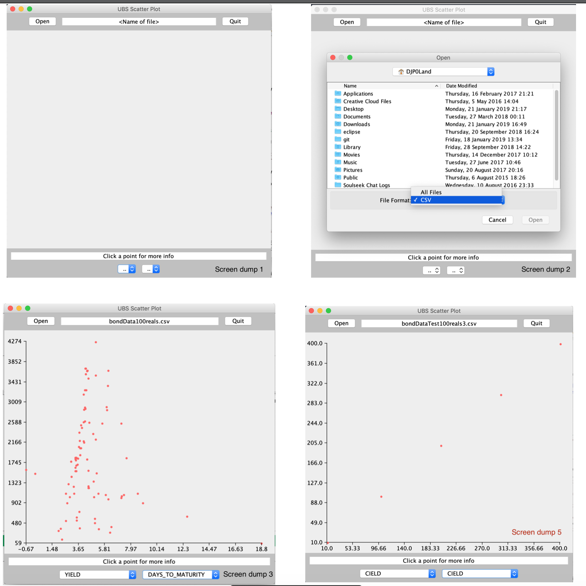

# JavaProgramming

AssEx1 a program allowing users to process a series of sales or returns for a fictional wine company. It calculates a total price for a transaction - including calculating an 80% cost for returns - and returns a receipt of the final cost for the user. Grade: A1

The AE3 folder contains a program that creates an interactive graphs based upon data supplied by a user in a CSV file. Grade: A1

Screen dumps the AE3 application:

